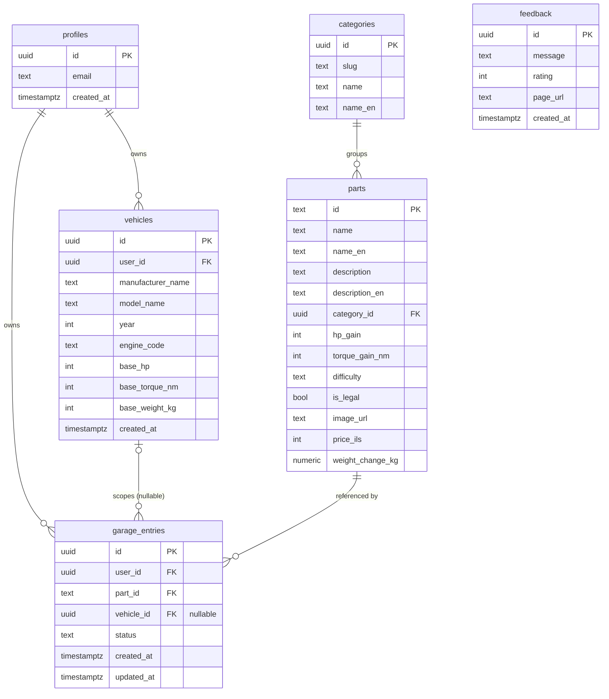

# WrenchLogic — ERD (Entity Relationship Diagram)

תרשים מסד הנתונים (Supabase / PostgreSQL). ניתן לצפייה ב-GitHub, ב-VS Code (עם תוסף Mermaid), או בכל מציג Markdown שתומך ב-Mermaid.

## הקשרים (Relationships)

| מ- | אל | סוג | הערה |
|----|-----|-----|------|
| `profiles` | `vehicles` | 1 — * | למשתמש יש מספר רכבים שמורים |
| `profiles` | `garage_entries` | 1 — * | למשתמש יש מספר חלפים בגראז' |
| `vehicles` | `garage_entries` | 1 — * | כל ערך גראז' משויך לרכב (אופציונלי — `vehicle_id` nullable; אורח = NULL) |
| `categories` | `parts` | 1 — * | כל קטגוריה מכילה מספר חלפים |
| `parts` | `garage_entries` | 1 — * | כל ערך גראז' מצביע על חלף |

## הערות

- `feedback` היא טבלה עצמאית (ללא מפתחות זרים) — מאחסנת משוב משתמשים, כולל אנונימי.
- `parts.id` הוא **TEXT** (מזהים כמו `wl-tur-001`), בעוד שאר המפתחות הראשיים הם **UUID**.
- `garage_entries.vehicle_id` הוא **nullable** כדי לאפשר גראז' לאורחים (ללא רכב שמור ב-DB).
- עמודות `name_en` / `description_en` תומכות בתצוגה דו-לשונית (עברית/אנגלית).
